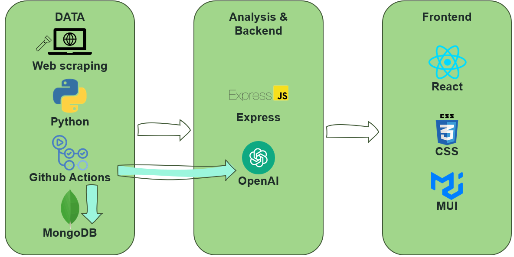
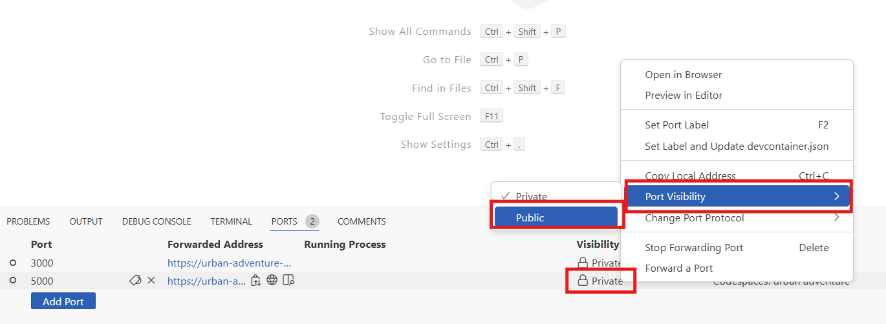
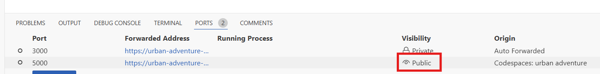

# Veracity
A tool to help you distinguish credible information in the world of misinformation. 

## Concept
Misinformation is not a new phenomenon, but technologies available today make it much easier to spread false or misleading information quickly and to a broad audience. To combat the spread of misinformation, it is important to be able to identify which sources can be trusted and how to think critically about the information you receive. 

The purpose of the Veracity app is to aid in this endeavor. With this app, anyone can enter a URL to an article they wish to examine or a block of text they want to analyze. When they run the analysis, they will get back three analyses:
- An overall credibility analysis containing a score and summary of the other analyses performed.
- A bias analysis with a classification and an explanation for the classification.
- A list of all the claims made within the submitted content and the associated factual evaluation, further information on the claim, and a list of sources to gain more insights. 

The intent of each analysis is to empower the user to think critically about the information they consume and to gain the ability to decipher fact from fiction. 

The prototype version of this app focuses on health data; however, there is the potential to expand to other categories.

[](https://youtu.be/b6_-WPEwvVE)

## Technology Stack
The following tools were used to develop this application.



**DATA** - A Python script was developed to scrape the factual data from [USAFacts Health Articles](https://usafacts.org/articles/category/health/). Once the data is scraped, it is added to a collection in MongoDB. Then, the associated vector store in OpenAI is updated with the new files. All of this is scheduled to run on a nightly basis using Github Actions. 

**ANALYSIS & BACKEND** - When a user submits content for analysis, it is processed in an Express server on the backend. This server handles the API calls to the OpenAI Assistants set up to evaluate the content and return the required information. There are two assistants that have been set up in OpenAI. The first assistant has instructions to perform a bias analysis and return the analysis in JSON format. The second assistant has instructions to perform a fact check and return the results in JSON format.

**FRONTEND** - The user interface is a webpage developed using Javascript and react to handle the API calls and structure. CSS and MUI are used for styling.

**AI USAGE** - AI tools such as ChatGPT and Github Copilot were used in the development of this app. 
- **ChatGPT**: ChatGPT was used to to help develop a structure for the files in the code base, troubleshooting code, exploring different libraries and tools for code, and to generate the background image for the website. 
- **Github Copilot**: Copilot was used to develop most of the code for the components in the frontend, specifically to help in areas I have little experience (mainly styling).

## How to run the code
### Running web scraping manually
If you would like to run the web scraping and database loading manually, you will need to:
- Install the necessary python libraries on your machine. To do this, run the following from the command line:
```bash
pip install -r requirements.txt
```
- Ensure you have a .env file containing a MONGO DB key and an OpenAI key

Once you have your environment set up, you can run 
```bash
python backend/scripts/pull.py
```
from the command line to perform the web scraping step. Then, run
```bash
python backend/scripts/update_vector_store.py
```
to push the new content to the OpenAI vector store.

### Running the application
To run the application, you will need to make sure you have the correct packages installed for the server and for the frontend. 

To install packages for the backend, run the command
```bash
npm install
```
from the base folder in the repo. To install the packages for the frontend, you will need to open a new terminal qindow and run the following commands:
```bash
cd frontend
npm install
```

Once all packages have been installed, you are ready to start the application. 

From the base folder, start the server by running 
```bash
node backend/server.js
```
This will start the server on port 5000. You will need to make this port public in order for the frontend to access it. You can do this by going to PORTS > Right click on *Private* under *Visibility* for Port 5000 > Select *Port Visibility* > Select *Public*


The port should appear as public. 


Once the server is running, start the frontend. To do this, make sure you are in a new terminal window and run
```bash
cd frontend
npm start
```
This will launch the application in a new window. If you get a message saying *"Error forwarding port"*, refesh the page and you will see the application. 